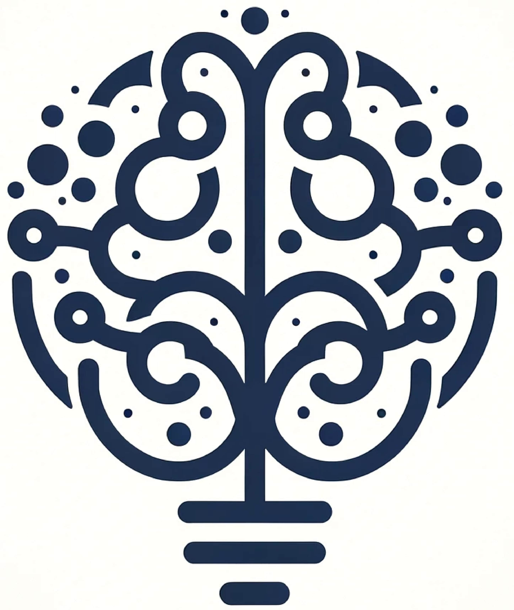
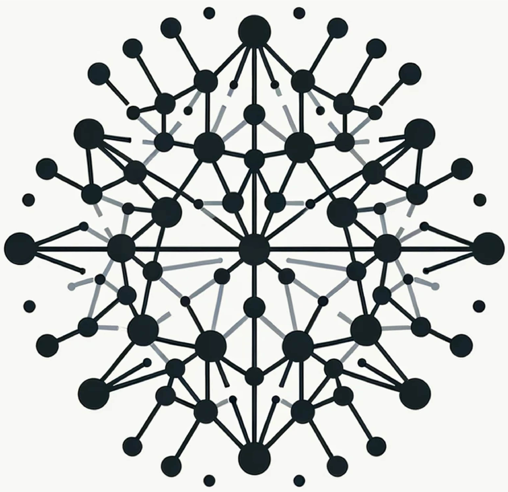
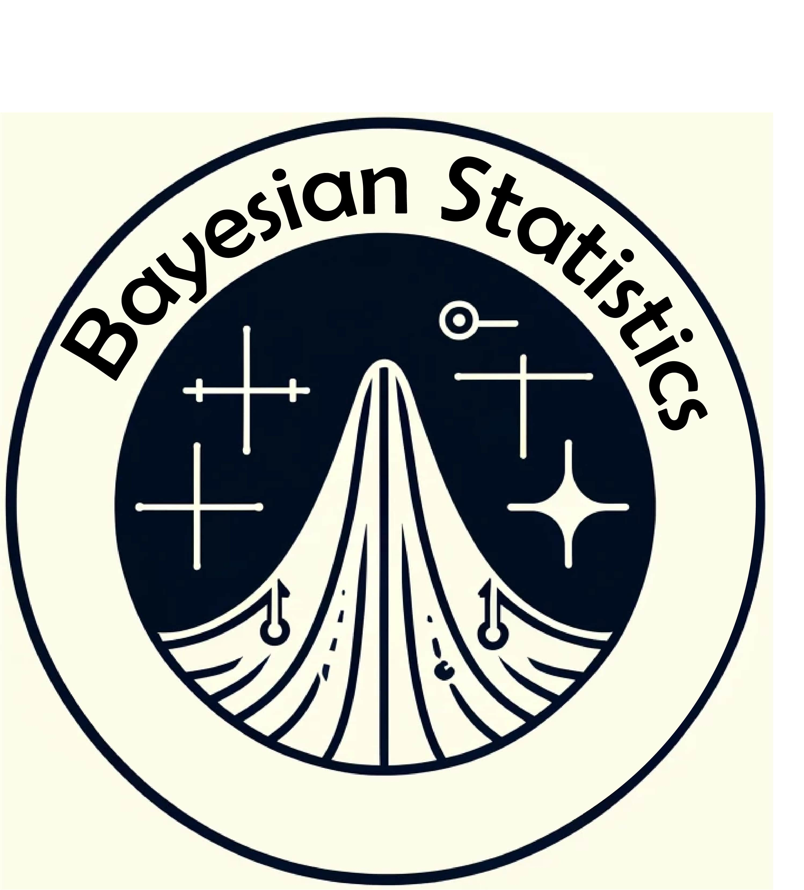

# Biography
I am a doctoral candidate in the research group of neural [Neural Circuits, Consciousness, and Cognition](https://www.aesthetics.mpg.de/forschung/forschungsgruppe-neural-circuits-consciousness-and-cognition.html) at the [Max Planck institute for empirical aesthetics](https://www.aesthetics.mpg.de). 

My research focuses on consciousness neuroscience, trying to unravel the neural mechanisms giving rise to conscious experience. I am combining theory-driven approaches with neural and psychophysical experimental paradigms to investigate unexplored dimension of conscious experience and the associated neural activation. I have a strong interest in the temporal dimension of experience in the visual domain. I am investigating the temporal dynamics of conscious experience and the underlying neural activation dynamics to test the prediction of theories of consciousness. 

I am also developping novel statistical methods to test theories predictions using bayesian statistics, to enable integration of evidence for various models over experiments, recording modalities and predictions. 

My commitment for advancing our understanding of conscious experience extends to the domain of meta-science. I am advocating for improving research practice standards, to increase transparency of all aspects of research project. I am developping new tools and methodologies to set new benchmarks for data collection andd sharing, following the principles of open science. 

## My expertise spans across:
 
 Intracranial electro-encephalography (iEEG) 
 
 
 
 Electro-encephalography (EEG)
 
 
 
 Psychophysics
 
 
 
 Cognitive neuroscience
 
 
 
 Univariate statistics
 
 
 
 Multivariate statistics
 
 
 
 Bayesian statistics
 
 
 

# Scientific publications
- Zeidman, P., Lepauvre, A., Melloni, L., Friston, K. Variational Representation Similarity Analysis (vRSA) for EEG/MEG, *in prep*
- Lepauvre, A., Engeser, M., Dehaene, M., Melloni, L. Investigating the timing of conscious experience using a dual-task paradigm and quantified introspection. *in prep*
- Seedat, A., Lepauvre, A., Jeschke, J., Gorska-Klimowska, U., et al. Open multi-center iEEG dataset with task probing conscious visual perception (2024). Submitted at Scientific data
- Lepauvre, Alex, Hirschhorn, Rony, Mudrik, Liad, Melloni, Lucia. "A standardized framework to test event-based experiments" Behavioral Research Methods [(2024)](https://link.springer.com/article/10.3758/s13428-024-02508-y)
- Grassi, Francesco, et al. "Relevance Acquisition through Motivational Incentives." [(2023)](https://osf.io/preprints/psyarxiv/3gvm6)
- Cogitate Consortium, et al. "An adversarial collaboration to critically evaluate theories of consciousness." BioRxiv [(2023)](https://www.biorxiv.org/content/10.1101/2023.06.23.546249v1)
- Melloni, Lucia, et al. "An adversarial collaboration protocol for testing contrasting predictions of global neuronal workspace and integrated information theory." PLoS One 18.2 [(2023)](https://journals.plos.org/plosone/article?id=10.1371/journal.pone.0268577)
- Lepauvre, Alex, and Lucia Melloni. "The search for the neural correlate of consciousness: Progress and challenges." Philosophy and the Mind Sciences 2 [(2021)](https://philosophymindscience.org/index.php/phimisci/article/view/9151).

# Connect with me:
alex.lepauvre@gmail.com

[Max Planck institute](https://www.aesthetics.mpg.de/en/the-institute/people/alex-lepauvre.html)

[ARC-COGITATE](https://www.arc-cogitate.com/alex-lepauvre)

# Language and tools:

  &nbsp;
  &nbsp;
  &nbsp;
  &nbsp;
  &nbsp;
  &nbsp;
  &nbsp;
  
  
  
  

# My github stats

